# Scry

**An on-device debugging suite for Kotlin Multiplatform apps.**

Chucker's network inspection, Flipper's storage tools, Pluto's plugin model — KMP-first, Java-friendly,
and built so it cannot ship to your users by accident.

> **Status: early release (`0.2.0`), available on Maven Central.** Expect the API to move before 1.0.
> Android, JVM desktop and iOS are all verified on-device/simulator with running sample apps.
>
> **Scry installs into apps that have Kotlin shared code.** Kotlin and Java callers are both
> first-class — the Java builder facade is compile-enforced on Android and desktop. A Swift app
> that shares a KMP module and uses Ktor is well served; a **pure Swift/`URLSession` app is not a
> consumer today**, because iOS capture goes through Ktor and `NSURLProtocol` interception is not
> implemented. See [iOS limitations](#ios-limitations-stated-plainly).

---

## Why this exists

| | Network | Prefs | DB | Crash/ANR | KMP |
|---|---|---|---|---|---|
| [Chucker](https://github.com/ChuckerTeam/chucker) | ✅ | ❌ | ❌ | ❌ | ❌ Android only |
| [Pluto](https://github.com/androidPluto/pluto) | ✅ | ✅ | ✅ | ✅ | ❌ Android only |
| [Flipper](https://github.com/facebook/flipper) | ✅ | ✅ | ✅ | ✅ | ❌ + desktop app required |
| Inspektify / Inspektor / NetLens / wiretapKMP | ✅ | ❌ | ❌ | ❌ | ✅ |
| **Scry** | ✅ | ✅ | ✅ | ✅ | ✅ |

Every KMP debugger on the market is network-only. Every full-suite debugger is Android-only.
Scry is the intersection: one plugin host, one UI, every target.

The **plugin API is the product**. Network, preferences, database and crash inspection are proof
that the API is expressive enough for anyone else's plugin — they use exactly the API you would.

<p align="center">
  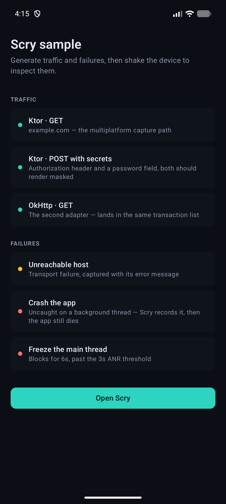
  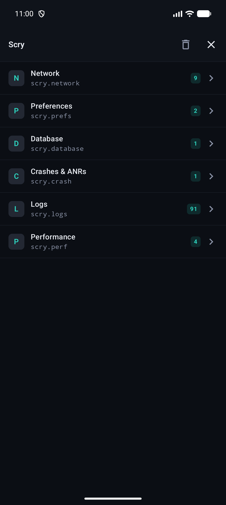
  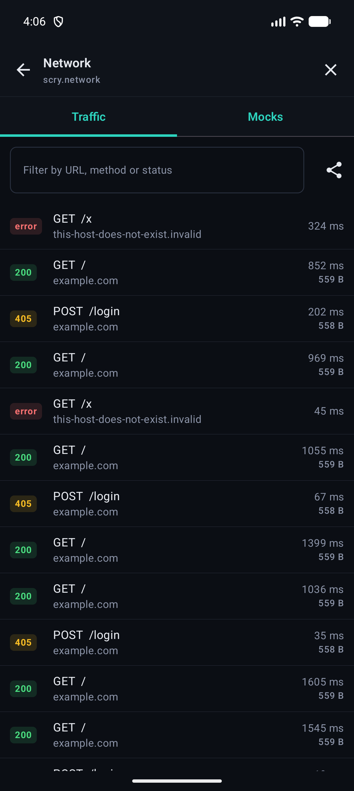
  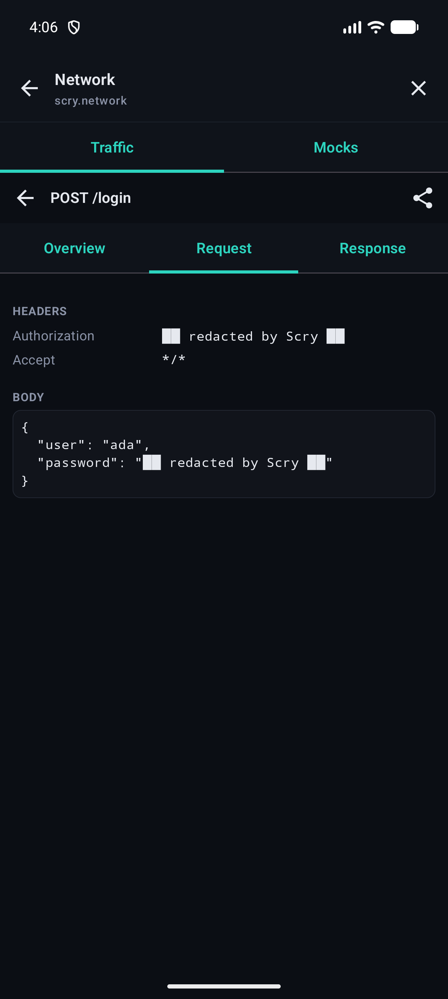
</p>
<p align="center">
  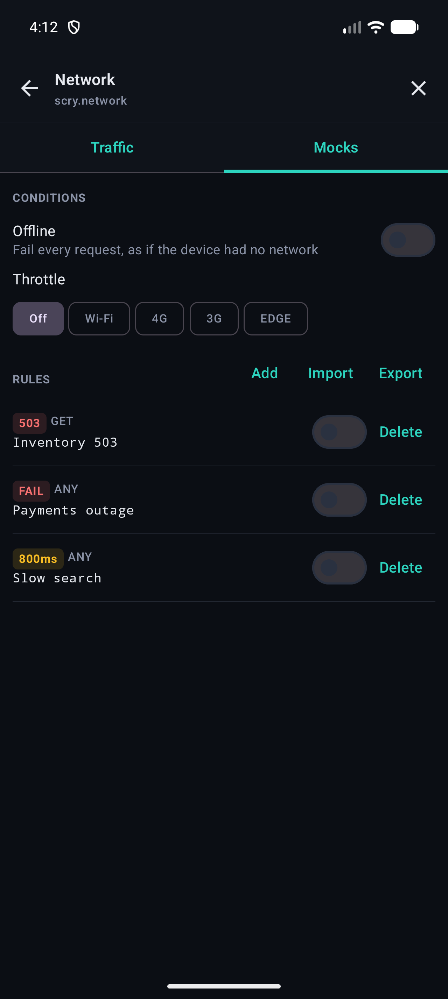
  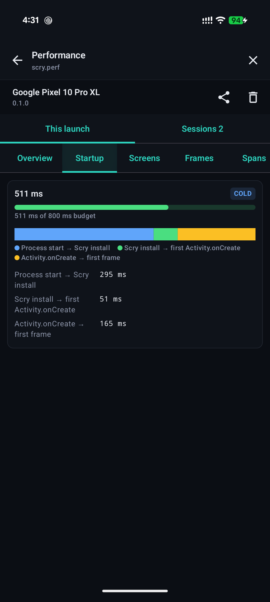
  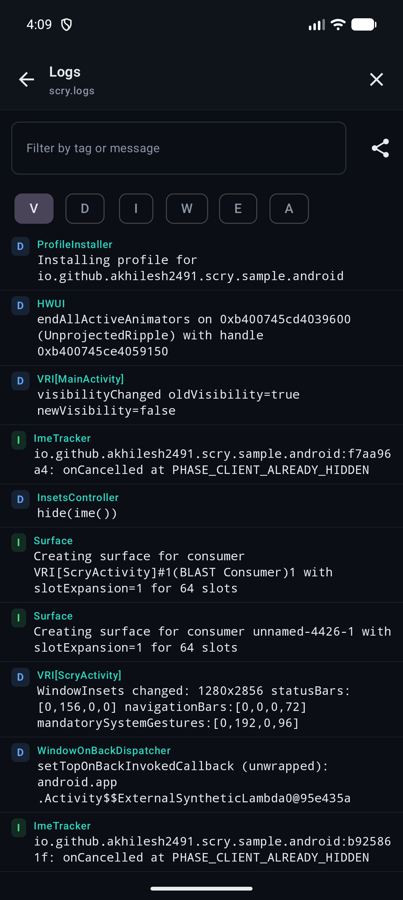
</p>
<p align="center">
  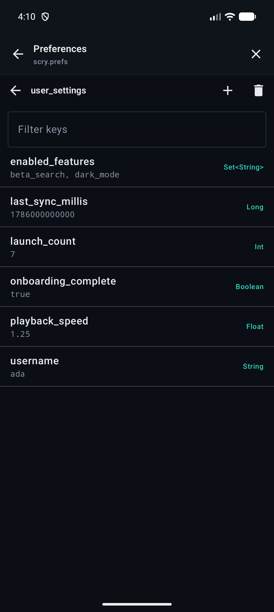
  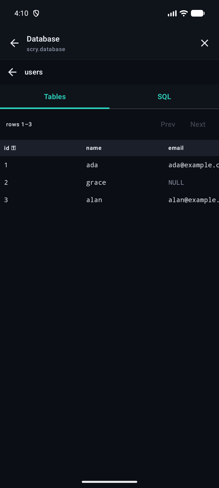
  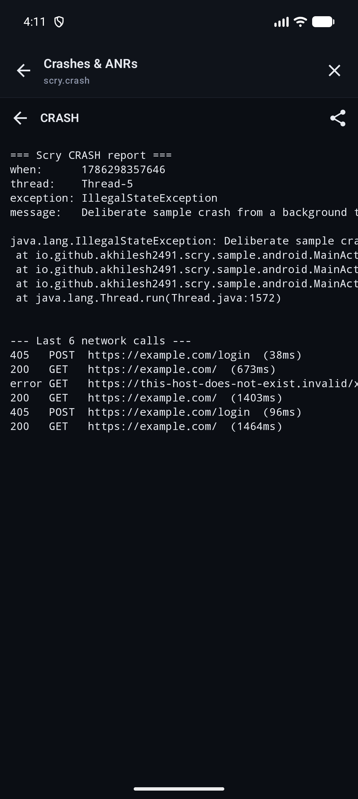
</p>
<p align="center">
  <em>iOS — the same Compose shell, presented over UIKit:</em><br/>
  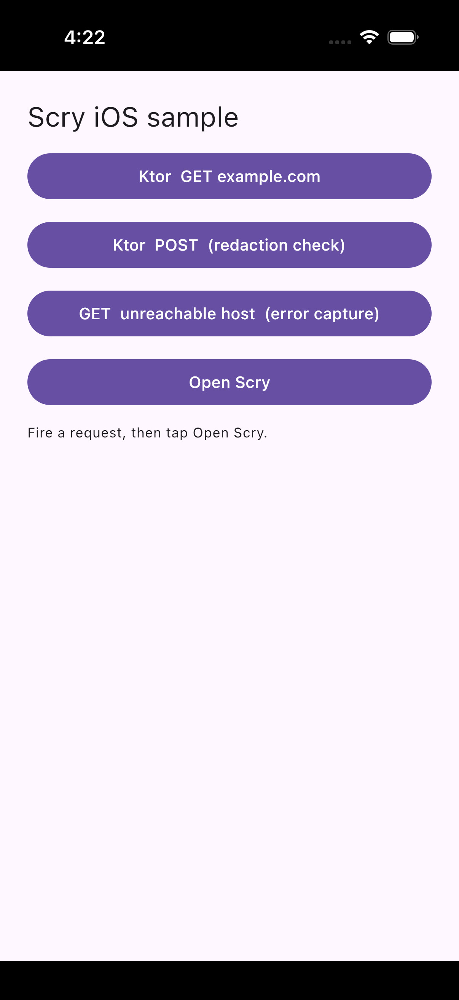
  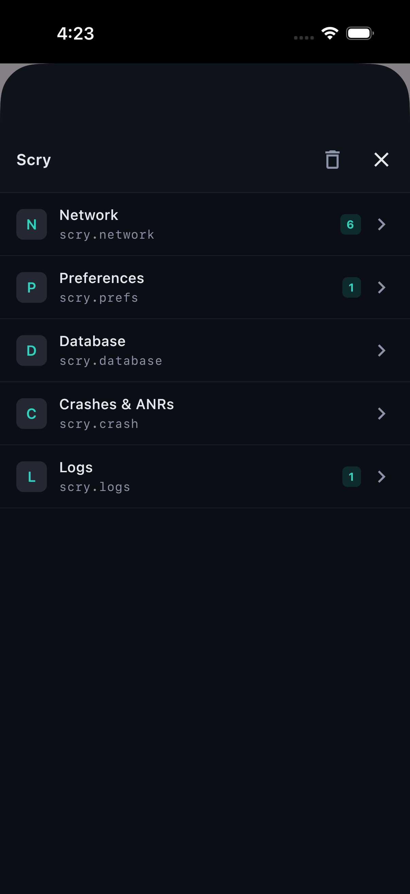
</p>

> Screens above are the Android sample in dark mode. Scry ships a light theme too, following the
> host app's system theme by default.

---

## Modules

| Artifact | What it does |
|---|---|
| `scry-core` | Plugin API, config DSL + Java builder, SQLite-backed store with retention, redaction, sharing, shake-to-open |
| `scry-ui` | Compose Multiplatform shell — plugin list, navigation, theme, Android activity host, desktop window |
| `scry-network` | Engine-agnostic `NetworkTransaction`, capture plugin, list/detail UI, HAR + cURL export |
| `scry-network-ktor` | Ktor client plugin — the multiplatform capture path |
| `scry-network-okhttp` | OkHttp 5 interceptor — the Android/Retrofit path |
| `scry-prefs` | Key-value store viewer **and editor** |
| `scry-database` | SQLite browser and editor — schema, rows, cell editing, SQL console |
| `scry-crash` | Crash + ANR capture with cross-plugin context, and report sharing |
| `scry-logs` | In-app logger, Android logcat capture, level/tag filtering |
| `scry-perf` | Startup, screen-load and frame timing with budgets, sessions and JSON/CSV export |
| `scry-no-op` | API-identical inert replacement for release builds, parity-gated in CI |
| `scry-gradle-plugin` | Wires debug/release variants and fails the build if Scry reaches release |

Targets: **Android** (minSdk 23), **JVM desktop**, and **iOS** (arm64 + simulator arm64).

---

## Installation

### Requirements

`0.2.0` is **built and verified against** these versions. Older ones may work but are untested —
if you are on an earlier Kotlin or AGP and hit a resolution failure, that is the first thing to check.

| | |
|---|---|
| Kotlin | 2.4.10 |
| AGP | 9.3.1 |
| Compose Multiplatform | 1.11.1 — only needed if you use `scry-ui` |
| JDK | 17 |
| Android | `minSdk 23`, `compileSdk 37` |
| Targets | `android`, `jvm` (desktop), `iosArm64`, `iosSimulatorArm64` |

`minSdk` is 23 rather than 21 because Compose Multiplatform pulls `androidx.navigationevent`. If you
are on 21 or 22 you can still take `scry-core` and the capture modules — it is `scry-ui` that
carries the floor.

There is **no `iosX64`** — `androidx.sqlite` publishes no Intel-simulator variant. Apple-silicon
simulators only.

> **Android projects can skip Steps 2 and 3.** The [Gradle plugin](#shortcut--the-gradle-plugin)
> does the debug/release wiring for you and fails the build if Scry reaches release. The manual
> route below is still what you want for KMP, desktop, or any project with custom variants.

### Step 1 — Add Maven Central

Scry publishes to Maven Central, so in most projects this is already there. In `settings.gradle.kts`:

```kotlin
dependencyResolutionManagement {
    repositories {
        mavenCentral()
    }
}
```

### Step 2 — Declare the version

In `gradle/libs.versions.toml`, so the modules can never drift apart:

```toml
[versions]
scry = "0.2.0"

[libraries]
scry-core           = { module = "io.github.akhilesh2491.scry:scry-core", version.ref = "scry" }
scry-ui             = { module = "io.github.akhilesh2491.scry:scry-ui", version.ref = "scry" }
scry-network-okhttp = { module = "io.github.akhilesh2491.scry:scry-network-okhttp", version.ref = "scry" }
scry-network-ktor   = { module = "io.github.akhilesh2491.scry:scry-network-ktor", version.ref = "scry" }
scry-prefs          = { module = "io.github.akhilesh2491.scry:scry-prefs", version.ref = "scry" }
scry-database       = { module = "io.github.akhilesh2491.scry:scry-database", version.ref = "scry" }
scry-crash          = { module = "io.github.akhilesh2491.scry:scry-crash", version.ref = "scry" }
scry-logs           = { module = "io.github.akhilesh2491.scry:scry-logs", version.ref = "scry" }
scry-perf           = { module = "io.github.akhilesh2491.scry:scry-perf", version.ref = "scry" }
scry-no-op          = { module = "io.github.akhilesh2491.scry:scry-no-op", version.ref = "scry" }
```

Take only the plugins you want — `scry-core` plus `scry-ui` is the minimum for a usable install.

### Step 3 — Add the dependencies

**Android** — the split matters. Real modules on `debug`, the no-op on `release`:

```kotlin
dependencies {
    debugImplementation(libs.scry.core)
    debugImplementation(libs.scry.ui)
    debugImplementation(libs.scry.network.okhttp)
    debugImplementation(libs.scry.prefs)
    debugImplementation(libs.scry.crash)

    releaseImplementation(libs.scry.no.op)
}
```

`scry-no-op` provides the same public API with empty implementations, so your `Scry.install(...)`
call still compiles in release without any `if (BuildConfig.DEBUG)` guards — and ships nothing.
See [Safety](#safety) for why this is the whole design.

**Kotlin Multiplatform** — add to `commonMain`; Gradle resolves the per-target variant:

```kotlin
kotlin {
    sourceSets {
        commonMain.dependencies {
            implementation(libs.scry.core)
            implementation(libs.scry.ui)
            implementation(libs.scry.network.ktor)
        }
    }
}
```

> `scry-network-okhttp` is JVM-only (Android + desktop) — OkHttp does not exist on Native. On iOS,
> use `scry-network-ktor`. Putting the OkHttp module in `commonMain` fails to resolve for the
> iOS targets.

**Desktop-only (JVM)** — plain `implementation`, since there are no build variants to separate:

```kotlin
dependencies {
    implementation(libs.scry.core)
    implementation(libs.scry.ui)
}
```

Gate it yourself with a debug flag, or use a custom `debug` source set.

### Step 4 — Install it at startup

Pick your platform below — [Kotlin](#kotlin), [Java](#java), [Desktop](#desktop) or
[iOS](#ios). The shortest possible Android version:

```kotlin
class MyApp : Application() {
    override fun onCreate() {
        super.onCreate()
        Scry.install(this) { plugin(NetworkPlugin()) }
        enableScryUi(this)
        ShakeToOpen(this).start()
    }
}
```

Then attach the capture point for whatever you use — an OkHttp interceptor, the Ktor plugin, a
`SupportSQLiteOpenHelper`. Nothing is captured until you do.

### Step 5 — Verify

Run a debug build, exercise some traffic, and **shake the device** (or `Scry.show()` from anywhere,
or **Ctrl/Cmd+Shift+S** on desktop). You should get the plugin list with live badges. If the UI
never appears, the usual cause is `enableScryUi(...)` not being called — `Scry.install` alone
captures data but registers no UI.

To confirm the release side is clean:

```bash
./gradlew assembleRelease
```

then check that no `scry-core` or `scry-ui` classes are in the APK. If you use the Gradle plugin
below, this is checked for you on every release build.

### Shortcut — the Gradle plugin

Steps 2 and 3 are mechanical, and hand-wiring `debugImplementation`/`releaseImplementation` for
every module you add is the single most common way an on-device debugger ends up in a shipped app.
The [`io.github.akhilesh2491.scry`](https://plugins.gradle.org/plugin/io.github.akhilesh2491.scry)
plugin does that wiring instead, and fails the release build if a real Scry artifact reaches the
release runtime classpath:

```kotlin
plugins {
    id("com.android.application")
    id("io.github.akhilesh2491.scry") version "0.1.0"
}

scry {
    modules.set(setOf(ScryModule.NETWORK_OKHTTP, ScryModule.PREFS, ScryModule.CRASH))
}
```

That replaces Steps 2 and 3 entirely. It adds `scry-core` and `scry-ui` to `debugImplementation`
automatically — a debugger you cannot open is not a debugger, and forgetting `scry-ui` produces a
confusing "nothing happens" rather than a compile error — plus whichever modules you list, and
`scry-no-op` to `releaseImplementation`. Library versions default to the plugin's own version, so
the two can never drift apart.

> The plugin is still at `0.1.0` while the libraries are at `0.2.0`. Because the default library
> version follows the plugin, applying it as shown wires the `0.1.0` libraries — set
> `version.set("0.2.0")` in the `scry` block to pull the current ones. `ScryModule.PERF` does not
> exist in the published plugin yet, so wire `scry-perf` by hand (Steps 2 and 3) until the plugin
> catches up.

Apply it **after** the Android application or library plugin: it needs the `debugImplementation`
and `releaseImplementation` configurations to already exist. If they don't, it logs a warning and
adds nothing, rather than half-wiring the build.

| Setting | Default | Notes |
|---|---|---|
| `modules` | `NETWORK_OKHTTP` | `NETWORK_KTOR`, `NETWORK_OKHTTP`, `PREFS`, `DATABASE`, `CRASH` |
| `version` | the plugin's version | override only if you need to pin the libraries separately |
| `enabled` | `true` | `false` adds no dependencies — useful for a staged rollout |
| `failOnReleaseLeak` | `true` | `false` drops the release-leak check |

The default is the network plugin alone, because that is why most people install Scry and pulling
in the storage inspectors silently would be a surprise. `scry-logs` has no `ScryModule` entry yet —
add it by hand if you want it.

The check itself runs as `checkScryNotInRelease`, wired into `assembleRelease*` and `bundleRelease`:

```bash
./gradlew checkScryNotInRelease
```

It walks the dependency resolution graph rather than an artifact view, so it catches published
coordinates *and* project dependencies — the latter matter more than they look, since composite
builds and this repo's own samples consume Scry that way.

---

## Usage

### Kotlin

```kotlin
class MyApp : Application() {
    override fun onCreate() {
        super.onCreate()

        Scry.install(this) {
            retention = Retention.of(24.hours, maxEntries = 1_000, maxBytes = 50L * 1024 * 1024)
            plugin(NetworkPlugin { maxBodyBytes = 256 * 1024 })
            plugin(PreferencesPlugin())
            plugin(DatabasePlugin { database(appDatabase) })
            plugin(CrashPlugin { anrThreshold = 4.seconds })
            plugin(LogPlugin { captureSystemLog = true })
        }

        enableScryUi(this)          // connect the Compose UI
        ShakeToOpen(this).start()   // shake to open
    }
}

// Ktor
val client = HttpClient { install(ScryKtor) }

// or OkHttp / Retrofit
val okhttp = OkHttpClient.Builder().addInterceptor(ScryInterceptor()).build()
```

### Java

```java
ScryAndroid.installer(context)
    .retention(Retention.ofHours(12))
    .redactHeaders("X-Internal-Trace")
    .addPlugin(new NetworkPlugin())
    .install();

new ShakeToOpen(context).start();

OkHttpClient client = new OkHttpClient.Builder()
    .addInterceptor(new ScryInterceptor())
    .build();
```

Java interop is **enforced by the build, not by intention**. A Java file in each sample compiles on
every build and breaks the moment a Kotlin-only construct reaches the public API.

### Desktop

```kotlin
val scry = Scry.install(PlatformContext(applicationId = "my-app")) { plugin(NetworkPlugin()) }

application {
    Window(onCloseRequest = ::exitApplication, onKeyEvent = ::onScryHotkey) { App() }
    scry?.let { ScryDesktopWindow(it) }   // renders only when shown
}
```

### iOS

```kotlin
val scry = Scry.install(PlatformContext()) { plugin(NetworkPlugin()) }
enableScryUi()   // presents over the key window when Scry.show() is called
```

Or present it yourself: `ScryUIViewController(instance)` returns a `UIViewController`.

Open with **shake** on Android, **Ctrl/Cmd+Shift+S** on desktop, `Scry.show()` from anywhere.

There is a runnable sample at `samples/sample-ios` (Compose shared code + a SwiftUI host generated
by [XcodeGen](https://github.com/yonaskolb/XcodeGen)):

```bash
./gradlew :samples:sample-ios:linkDebugFrameworkIosSimulatorArm64
cd samples/sample-ios/iosApp && xcodegen generate && open ScrySample.xcodeproj
```

> **Building a release iOS framework** needs a large Kotlin/Native heap — set
> `kotlin.native.jvmArgs=-Xmx8g` in `gradle.properties`, and avoid linking both architectures in
> parallel. Whole-program optimisation over Compose OOMs at the 3 GB default with no hint that
> heap is the problem.
>
> **If you host Compose on iOS yourself**, your `Info.plist` needs
> `CADisableMinimumFrameDurationOnPhone = true`. Compose Multiplatform refuses to start without it.
> Nothing to do with Scry — but it is the first thing that will stop you.

#### What is verified on iOS

`./gradlew iosSimulatorArm64Test` runs 115 tests as real Kotlin/Native code on the simulator: the
store on a Documents-backed SQLite file (including retention eviction), the pthread lock, the clock,
Ktor capture, redaction, HAR/cURL export, the database inspector, and `NSUserDefaults` round-trips —
including that a stored boolean reads back as a boolean rather than a number, which is how feature
flags would otherwise turn into `0`/`1`.

The sample confirms the rest on a simulator: the Compose shell presents as a page sheet over the
SwiftUI host, all four plugins register with live badges, and captured traffic lands in
`Documents/scry/<bundle-id>/scry.db` with `Authorization` and password fields already masked.

#### iOS limitations, stated plainly

- **Network capture works through Ktor only.** Apps using `URLSession` directly are not captured;
  `NSURLProtocol` interception is not implemented yet.
- **Crash capture sees Objective-C exceptions, not fatal signals** (`SIGSEGV`, `SIGABRT`) — which is
  how most Kotlin/Native crashes actually terminate. Keep a dedicated crash reporter for production;
  Scry is for the debug loop.
- **No ANR watchdog.** iOS has no equivalent concept; its own watchdog kills the app outright.
- **`NSUserDefaults` named suites cannot be discovered** — the API offers no enumeration. Register
  them with `store(NSUserDefaults(suiteName = "…").asScryStore("…"))`.
- **No `iosX64`.** `androidx.sqlite` publishes no Intel-simulator variant.

---

## What each plugin gives you

### Network

Requests and responses with headers, bodies, status, duration, size and protocol; pretty-printed
JSON; search; in-flight requests visible before they complete (so a hung call is diagnosable);
errors captured with their message.

Two capture adapters — **Ktor** (all targets) and **OkHttp 5** (Android/JVM) — produce the same
`NetworkTransaction`, so they share one UI, one store and one export path. Use both at once; they
land in the same list.

**Mocking, throttling and fault injection** live in a *Mocks* tab beside the traffic list:

```kotlin
plugin.mocks.addRule(
    MockRule(
        id = "orders-down",
        urlPattern = "*/orders*",          // glob, not regex — URL metacharacters are escaped
        method = "GET",                     // or null for any
        action = MockAction.Respond(statusCode = 503, body = """{"down":true}"""),
    ),
)
plugin.mocks.setThrottle(ThrottleProfile.SLOW_3G)
plugin.mocks.setOffline(true)
```

Actions are `Respond` (canned response, never touches the network), `Fail` (injected transport
error) and `Delay` (real request, added latency). Rules apply to **both adapters**, so one rule
fires whether the call goes through Ktor or OkHttp.

Mocked responses carry a `Scry-Mocked: true` header and are captured in the traffic list like any
other — silently faking traffic with no trace is how people lose an afternoon. The Mocks tab shows
a dot when anything is active, for the same reason.

Rules **export as JSON** so a QA engineer can configure a scenario on a device, commit the file,
and have everyone reproduce the same failure. A mocking feature you cannot share is a toy.

**Export**: HAR 1.2 for the whole session (imports into Charles, Proxyman, Insomnia, DevTools) and
runnable, correctly-quoted cURL per request.

### Preferences

Discovers every `SharedPreferences` file automatically — lazily, so stores created after startup
still appear. Values are typed, and edits **preserve the stored type**: Scry refuses to rewrite an
`Int` key as a `String`, because that is exactly how the host app gets a `ClassCastException` on its
next read.

Pass encrypted stores explicitly — file scanning would only show ciphertext:

```kotlin
plugin(PreferencesPlugin { store(securePrefs.asScryStore("secure")) })
```

### Database

| Mode | How | Trade-off |
|---|---|---|
| **Instance** (recommended) | `DatabasePlugin { database(myDb) }` | No lock contention, no stale reads, works with SQLCipher |
| **File** (zero config) | auto-discovered from `databases/` | **Read-only by default** — a second writer on a non-WAL file can block the app |

Table list with row counts, schema-aware headers with primary-key markers, paginated rows, NULL
rendered distinctly, inline cell editing matched by primary key, and a SQL console.

`allowFileModeWrites(true)` opts into writes on discovered files. Prefer instance mode.

### Crashes and ANRs

Uncaught exceptions and main-thread stalls, persisted across process death so you can read them on
the next launch. Reports arrive with the **last 25 network calls already attached**:

```
=== Scry CRASH report ===
thread:    Thread-5
exception: IllegalStateException
message:   Deliberate sample crash from a background thread
…
--- Last 6 network calls ---
405   POST  https://example.com/login  (38ms)
200   GET   https://example.com/  (673ms)
error GET   https://this-host-does-not-exist.invalid/x
```

`scry-crash` has **no dependency on `scry-network`**. Plugins contribute diagnostics through
`ScryContextRegistry` in core, so either module stays independently droppable.

Two guarantees:

- **Scry never swallows a failure.** The previously installed uncaught-exception handler is always
  invoked afterwards, so Crashlytics and the system crash dialog behave exactly as before.
- **ANR stacks are captured while the thread is still blocked**, from a watchdog thread. Reading the
  stack after the stall clears would show nothing useful.

### Logs

```kotlin
plugin(LogPlugin { captureSystemLog = true })

ScryLog.i("Checkout", "Placing order $id")
ScryLog.e("Checkout", "Payment failed", throwable)
```

Filter by level, tag or free text; tap an entry with a throwable to expand its stack. On Android
`captureSystemLog` tails logcat for this process, so framework output shows up alongside your own.

This does **not** replace your logger — point your existing Timber tree or SLF4J appender at
`ScryLog.record(...)` rather than rewriting call sites. Recent lines are attached to crash reports,
so a crash arrives with the narrative that led to it.

Two defaults worth knowing: entries are capped in memory (2000) and trimmed on write, because logs
arrive far faster than anything else Scry captures; and they are **not** persisted unless you set
`persist = true`, which trades store size for surviving process death.

### Performance

```kotlin
plugin(PerfPlugin {
    budget {
        coldStartupMillis = 800
        slowFramePercent = 5.0
    }
})

ScryTrace.measure("checkout") { placeOrder(cart) }
```

Cold/warm startup broken into phases, per-screen time-to-initial-display, frame timing with
percentiles and slow/frozen counts, and manual spans — all on-device, in a debug build, while you
use the app. Numbers are checked against budgets you set; breaking one counts on the plugin's badge,
lists it in red under **Over budget**, publishes a `PerfViolationEvent`, and calls your `onViolation`
hook if you registered one.

Each launch is kept as a **session**, so the Sessions tab compares this run against the last 20.
Recent measurements are attached to crash reports, and the whole history exports as JSON or CSV.

Activities and Fragments are instrumented automatically. Fragments need no dependency from you —
`androidx.fragment` is `compileOnly` here and the hook is skipped if your app does not have it.
For anything else — a Compose screen, a custom navigator, a UIKit view controller — one call is
enough:

```kotlin
LaunchedEffect(Unit) { ScryTrace.screenEntered("Checkout") }
ScryTrace.reportFullyDrawn("Checkout", millisSinceEntered)   // optional TTFD
```

`ScryTrace` is deliberately not a `@Composable`: everything an app calls in shared code needs an
inert mirror in `scry-no-op`, and a `@Composable` mirror would mean shipping Compose in release —
the one thing that artifact exists to prevent.

#### What each target actually measures

|  | Startup | Screen load | Frames |
|---|---|---|---|
| **Android API 24+** | ✅ true process start, 3 phases | ✅ automatic (Activity, Fragment) | ✅ `FrameMetrics`, real refresh rate |
| **Android API 23** | ⚠️ from Scry's install, marked truncated | ✅ automatic | ❌ see below |
| **iOS** | ⚠️ from framework load, marked truncated | ✅ via `screenEntered` | ⚠️ `CADisplayLink` — main-thread stalls only |
| **JVM desktop** | ⚠️ JVM start, marked truncated | ✅ via `screenDisplayed` | ❌ see below |

The gaps are stated rather than papered over, and the plugin's own screen repeats them in place:

- **API 23 has no `FrameMetrics`.** The alternative is re-posting a `Choreographer` callback every
  frame, which keeps the Choreographer awake and so *produces* the frames it claims to observe.
- **Desktop has no frame capture** for the same reason: a perpetual `withFrameNanos` loop
  invalidates every frame and would measure Scry rather than the app.
- **iOS `CADisplayLink`** fires from the main run loop, so a long interval proves the main thread
  was blocked — which is what iOS jank usually is. It cannot see the GPU.
- **iOS and desktop startup** begin after the expensive part of launch (dyld and ObjC registration;
  JVM class loading), so both are marked truncated.

One thing to keep in mind about every number here: this is a debug build, with Scry installed and
no R8. Use it to compare your own runs against each other, not as a figure to quote against release.

---

## Safety

An on-device debugger that reaches production is a security incident, not a bug. Scry is built
around that.

- **Redaction is on by default.** `Authorization`, `Cookie`, `Set-Cookie`, `Proxy-Authorization`,
  `X-Api-Key` and body keys matching `password|token|secret|otp|pin` are masked *on capture* —
  before anything is stored, displayed or exported. Exports are safe by construction.
- **Release builds refuse to install.** `Scry.install` returns `null` in a non-debuggable build
  unless `allowInReleaseBuilds = true` — deliberately verbose and greppable.
- **The Gradle plugin fails the release build** if a real Scry artifact is on the release runtime
  classpath, detecting both Maven coordinates and project dependencies.
- **Bounded storage.** Retention is enforced on the write path by age, count *and* total bytes —
  not by a periodic sweep, which still lets the store spike in between.
- **Nothing leaves the device** unless you tap share. No telemetry, ever.
- **Mocking is never silent.** Mocked responses carry `Scry-Mocked: true`, are captured like real
  traffic, and the Mocks tab shows a dot while any rule, throttle or offline mode is active.

### The no-op artifact

`scry-no-op` mirrors the public API exactly and does nothing — no SQLite, no Compose, no
serialization, no handlers, no watchdog thread. Swapping it in cannot break compilation, and that
promise is **machine-checked**:

```bash
./gradlew :scry-no-op:checkNoOpParity   # 975 signatures across 9 modules
```

The gate compares public signatures of the real desktop jars against the no-op and fails on
anything missing. It has already caught four real gaps — including `REDACTED` landing in the wrong
JVM facade class because a no-op file had a different *file name* than the real one (Kotlin derives
facade class names from file names, so Java callers would have broken).

The strongest check is the sample itself: `./gradlew :samples:sample-android:assembleRelease`
compiles the entire app against the no-op. The sample APK goes from **24.8 MB debug to 9.4 MB
release** — that 15 MB is Scry, Compose and SQLite leaving the build.

One deliberate exclusion: `scry-ui` has no no-op mirror, because a Compose-carrying stub in a
release build would defeat the point. App code never references it — `enableScryUi` lives in
`scry-core` and starts the UI activity **by class name**, so the UI module can simply be absent.

---

## Building

Requires **JDK 17** and the Android SDK (compileSdk 37, minSdk 23).

```bash
./gradlew build                                   # everything: Android + desktop, tests, parity gate
./gradlew :samples:sample-desktop:run             # desktop sample — Ctrl/Cmd+Shift+S opens Scry
./gradlew :samples:sample-android:installDebug    # Android sample — shake to open
./gradlew :samples:sample-android:assembleRelease # proves the no-op swap compiles
```

Current state: **13 modules, 665 tests, 0 failures** — 218 on the JVM desktop, 224 on the Android
host, 210 on the iOS simulator, 13 for the Gradle plugin.

### Repository layout

```
scry-core/              plugin API, store, redaction, sharing, launchers
scry-ui/                Compose Multiplatform shell
scry-network/           capture model + UI + exporters
scry-network-ktor/      Ktor adapter
scry-network-okhttp/    OkHttp adapter
scry-prefs/             preferences inspector
scry-database/          SQLite inspector
scry-crash/             crash + ANR capture
scry-logs/              in-app logger + logcat capture
scry-perf/              startup, screen-load and frame timing
scry-no-op/             inert mirror of all of the above
scry-gradle-plugin/     variant wiring + release-leak check (its own included build)
build-logic/            convention plugins (also an included build)
samples/                sample-android (Kotlin + Java), sample-desktop (Kotlin + Java)
tools/                  check-noop-parity.py
```

---

## Writing a plugin

Built-in features use exactly the API third parties do. If it cannot express a built-in, the API is
wrong.

```kotlin
class MyPlugin : ScryUiPlugin {
    override val id = "acme.myplugin"
    override val displayName = "My Plugin"
    override val badge = MutableStateFlow<String?>(null)

    override fun onInstall(scope: ScryScope) {
        // scope gives you: context, coroutineScope, store, events, contextRegistry, config
        scope.contextRegistry.register(id) {
            listOf(ScryContextSection("My state", describeState()))
        }
    }

    override fun onClear() { /* drop your data */ }

    @Composable
    override fun Content() { MyScreen() }
}
```

Test it without installing Scry — `ScryTesting.scope()` ships in the main artifact precisely so
plugin authors are not forced through a real install with a platform context and a database file:

```kotlin
val plugin = MyPlugin().apply { onInstall(ScryTesting.scope()) }
```

---

## Roadmap

**Done:** network (Ktor + OkHttp), preferences, database, crashes/ANRs, logs, performance
(startup / screen load / frames), HAR + cURL export, no-op + parity gate, Gradle plugin,
Android + desktop + iOS.

**Published:** `0.2.0` on Maven Central, signed, across Android, JVM desktop and iOS · the Gradle
plugin at `0.1.0` on the
[Gradle Plugin Portal](https://plugins.gradle.org/plugin/io.github.akhilesh2491.scry).

---

## Contributing

The repository is pre-alpha and the plugin API is not frozen. If you are building against it,
expect breaking changes until `1.0`.

Every change must keep `./gradlew build` green, which includes the no-op parity gate. If you add a
public declaration to a real module, add its mirror to `scry-no-op` in a file with the **same name**.

## License

[Apache 2.0](LICENSE).
